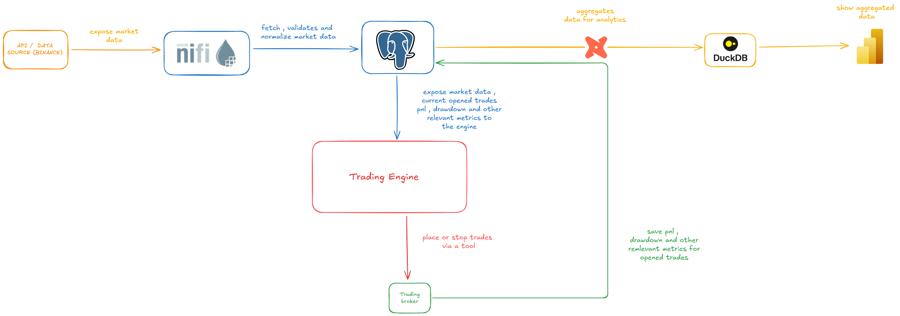

# Crypto Market Data Platform

## Overview

This project is a **market data ingestion and analysis platform** designed to collect, store, and analyze cryptocurrency market data at scale.

The system focuses on building a **reliable data foundation** for:

* market analysis
* strategy research
* long-term trading experiments
* infrastructure experimentation

The architecture prioritizes:

* **data integrity**
* **observability**
* **security**
* **clear separation between ingestion, storage, and analytics**

Rather than targeting ultra-low latency trading, the platform is designed for **systematic strategies operating on longer time horizons** (for example hourly signals or trend-following strategies).

---

# Architecture Overview

Below is a simplified view of the platform architecture.




Supporting infrastructure includes:

* **Vault PKI** for service identity and certificate management
* **Vault Agent** for automated certificate lifecycle and secret distribution
* **Prometheus + Grafana** for system monitoring
* **Nifi Registry** for nifi flow version control
* **Nginx** for controlled external access to dashboards

---

# Core Components

## Market Data Ingestion — Apache NiFi

**Apache NiFi** is responsible for ingesting and normalizing market data from exchange APIs.

NiFi pipelines collect several categories of market information:

* market trades
* orderbook snapshots (L1 / L2)
* OHLCV candles
* derivatives metrics (funding rates, open interest, liquidations)

NiFi provides important ingestion guarantees such as:

* visual flow management
* backpressure control
* retry handling
* reliable data delivery

Flows are versioned using **NiFi Registry**, allowing reproducible pipeline deployments and controlled updates.

---

## Time Series Storage — PostgreSQL + TimescaleDB

Market data is stored in **PostgreSQL extended with TimescaleDB** for efficient time-series management.

TimescaleDB is used to store large volumes of:

* trades
* candles
* orderbook updates
* derivatives data

Features used include:

* hypertables
* time-based partitioning
* compression policies
* optimized time-series indexes

The database schema combines two main categories:

### Event tables

These store time-based events such as:

* market events
* trading signals
* order lifecycle events
* executed trades
* position updates

### Reference tables

These provide contextual metadata:

* assets
* symbols
* strategies
* trading sessions

This hybrid design allows both:

* **efficient operational queries**
* **long-term analytical workloads**

For a full explanation of the schema and database design see:

👉 **[Database Documentation](./database/DATABASE.md)**

---

## Analytics Layer

Operational queries run directly on PostgreSQL.

Heavier analytical workloads are exported and processed using **DuckDB**, allowing analysts and dashboards to run complex queries without affecting the operational database.

This architecture ensures:

* stable ingestion performance
* scalable analysis pipelines
* separation between production and analytics workloads

---

## Trading Engine (Future Phase)

A future component of the platform will be the **trading engine**, which consumes market data from the database and produces trading signals.

Responsibilities will include:

* signal generation
* order placement
* risk checks
* position management

All trading activity will be recorded using an **event-driven schema**, enabling full traceability of strategy decisions.

---

# Observability

The platform includes a full monitoring stack to ensure reliability and transparency.

### Prometheus + Grafana

Prometheus collects metrics from multiple services, including:

* PostgreSQL performance metrics
* Vault health and activity
* infrastructure statistics
* database usage metrics

Grafana provides dashboards for monitoring system behavior and detecting anomalies.

### NiFi Monitoring

NiFi is monitored both:

**Internally**

Through the NiFi UI which provides:

* pipeline counters
* data provenance tracking
* processor performance metrics
* flow-level statistics

**Externally**

Using Prometheus and Grafana to monitor:

* ingestion throughput
* service health
* system resource usage

This dual monitoring approach ensures both **operational visibility and infrastructure observability**.

For more details see:

👉 **[Monitoring Documentation](./monitoring/MONITORING.md)**

---

# Security Architecture

The system follows a **zero-trust architecture based on certificate identity**.
All services authenticate using **mutual TLS certificates issued by Vault**.
A service's certificate effectively acts as its **identity within the system**.

Security mechanisms include:

* automatic certificate generation
* automated certificate rotation
* service-level identity verification
* network segmentation
* strict access control policies

Vault is responsible for managing the internal PKI and distributing credentials through **Vault Agent**.

A full description of the security model can be found here:

👉 **[Security Architecture](./security/SECURITY.md)**

---

# Repository Structure

```
.
├── database/
├── nifi/
├── nginx/
├── security/
│   └── vault/
├── monitoring/
│   ├── prometheus/
│   ├── grafana/
│   └── prometheus-exporter/
├── images/
├── Readme.md
├── docker_compose.yaml
├── docker_compose_security.yaml
├── .gitignore
├── .env.example
├── .gitignore

```

Each subsystem contains its own documentation explaining its configuration and internal design.

---
# Run the Stack

The platform is started in **two stages**.

The first stage initializes the **security infrastructure** (Vault, PKI, certificates, and secret distribution).
The second stage starts the **application stack**.

### 1. Start the Security Layer

```bash
docker compose -f docker_compose_security.yml up -d
```

This step initializes:

* Vault
* PKI infrastructure
* Vault Agent
* certificate generation and secret distribution

The security layer must be running before the rest of the platform can start.

---

### 2. Start the Application Stack

```bash
docker compose up -d
```

This starts the remaining services:

* NiFi
* NiFi Registry
* PostgreSQL / TimescaleDB
* Prometheus
* Grafana
* supporting services

---

Once both steps are complete, the full platform stack is operational.

---

# Development Roadmap

The platform is developed in multiple phases.

### Phase 1 — Market Data Ingestion

* NiFi ingestion pipelines
* market data schema
* TimescaleDB storage
* monitoring stack

### Phase 2 — Trading Engine

* signal generation
* order lifecycle management
* strategy execution framework

### Phase 3 — Analytics Platform

* historical analysis tools
* strategy evaluation
* advanced dashboards

---

# Project Progress

Current progress of the project:

* [x] Phase 1 — Market Data Ingestion
* [ ] Phase 2 — Trading Engine
* [ ] Phase 3 — Analytics Platform

---

# Goals of the Project

This project is primarily an **engineering experiment** exploring the design of a secure and observable trading infrastructure.

It aims to demonstrate:

* robust market data ingestion pipelines
* time-series database design
* event-sourced trading systems
* zero-trust service architectures
* monitoring and observability practices

The focus is on **architecture and infrastructure design**, not high-frequency trading.

---

# Disclaimer

This project is intended for **educational and research purposes only**.

It does not constitute financial advice and should not be used for live trading without extensive testing and risk management.
